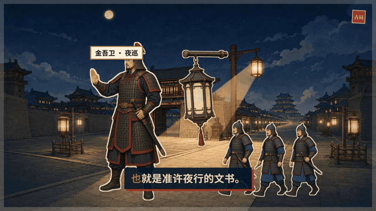

# VOX Video Starter

<p align="center">
  
</p>

<p align="center"><strong>把一个内容方向交给 Codex，自动完成环境配置、素材生成、配音、字幕、VOX 纸片拼贴动画、审片和高清成片交付。</strong></p>

<p align="center">
  
  
  
  
  
</p>

## 效果展示

下面是三条真实成片的 5 秒循环片段。GIF 仅用于快速预览，正式交付仍为带完整配音与音效的 1080p MP4。

| 八百里加急：驿路与接力文书 | 全城同时关门：鼓声与城门信号 |
| --- | --- |
|  |  |

<p align="center">
  <strong>唐朝宵禁晚归：夜巡角色与通行文书</strong><br />
  
</p>

## 复制给 Codex，开始使用

不需要先手动安装依赖或配置运行环境。新建一个 Codex 任务，把下面整段内容复制过去：

```text
请帮我安装并接管 VOX Video Starter，然后带我完成内容方向配置。项目仓库：
https://github.com/lyyilin/vox-video-starter.git

请自主执行下面的工作，不要把安装命令和常规环境配置转交给我：

1. 先检查当前工作区。如果已经位于 vox-video-starter 仓库，就直接使用；如果没有仓库，就在当前工作区内克隆上述地址。不得覆盖同名目录或用户已有文件。
2. 完整读取仓库内的 README.md、skills/vox-video-studio/SKILL.md，以及 Skill 要求的必要 references 和 docs。当前任务即使尚未发现全局 Skill，也要直接遵守仓库内 Skill；同时将它安全安装到用户级 Skill 目录，供后续新任务使用。若目标位置已有同名 Skill，先比较内容，禁止盲目覆盖。
3. 自动识别操作系统，检查 Git、Node.js 20+、pnpm 9+、Python 3.10、FFmpeg 和 FFprobe。缺失时使用该系统可信的官方安装渠道自动安装；只有确实需要管理员权限时才向我申请确认。禁止关闭 TLS 证书验证，禁止使用不可信下载源，禁止修改无关的全局配置。
4. 自动完成 Remotion/npm 依赖、Python 虚拟环境、rembg 和 Seed-TTS 2 适配器的安装。运行适合当前系统的 setup 脚本，并在 studio 中运行 pnpm run doctor、pnpm run lint 和 pnpm test。普通网络错误自动重试；失败时先诊断原因并完成仍可执行的步骤。
5. Whisper 模型、rembg 模型和 Remotion 浏览器按需下载，不要让大型下载阻塞首次内容方向配置；第一次真正用到它们时自动完成下载和验证。
6. 检查当前 Codex 是否具有内置 Imagegen、Worker/Subagent 和 Remotion best-practices Skill/插件。可以通过当前环境安装或启用时由你处理；确实不可用时说明具体影响，不要伪造能力，也不要用项目里的 OpenAI API 替代内置 Imagegen。
7. 检查 studio/.env 和默认音色。若 Seed-TTS 2 的音色 ID 或 API Key 缺失，先引导我阅读 docs/SEED_TTS2_SETUP.md，再向我索取一次。由你把 API Key 写入被 Git 忽略的 studio/.env，并把音色 ID 配置到项目中。密钥不得被重复展示、回显、写进命令行、日志、代码、JSON、补丁差异或 Git 提交。不得读取或展示其他已有密钥。
8. 环境达到可用状态后，不要等待大型模型下载，立即开始首次内容配置。每轮最多问我三个简短问题，收集内容定位、目标受众、选题范围、证据标准、口播语气、视觉方向、内容禁区、发布平台和目标时长。
9. 将整理后的完整方向写入 studio/config/content-profile.md，展示给我并暂停，等待我回复“方向确认”。方向确认前不要研究具体选题、写最终逐字稿、生成图片、调用 TTS 或渲染视频。
10. 方向确认后，每条视频严格执行：选题与研究 → 最终逐字稿与分镜 → 等待“分镜确认” → 主任务只生成一张总宫格图 → 每张正式背景、人物和道具由独立 Worker 单独生成 → rembg → 完整逐字稿一次 TTS → Whisper 对齐 → 字幕驱动 Remotion 动画 → 低清样片与 QA → 等待“低清确认” → 高清渲染与最终 QA。

整个过程中优先自主推进。只有系统权限、密钥、内容方向、分镜和低清样片这些必须由我决定的事项才暂停询问；不要让我手动执行本可以由你完成的配置步骤。
```

## 使用需要配置 Seed-TTS 2 API Key

旁白不仅决定视频听起来是否自然，也是整条视频的时间轴：Whisper 会根据旁白生成字幕时间，人物入场、镜头切换、标签和音效再由字幕驱动。没有可用的 Seed-TTS 2 音色与 API Key，Agent 可以完成内容和环境配置，但无法生成正式配音并继续完成字幕驱动的成片。

项目不会内置公共密钥或替你选择音色。你只需在火山引擎试听并选择一个音色、开通模型、取得音色 ID 和 API Key；其余接入与验证交给 Agent。

**[查看 Seed-TTS 2 图文配置教程 →](docs/SEED_TTS2_SETUP.md)**

## Agent 会自动完成

- 判断项目是否已经克隆，并接管正确的工作目录；
- 安装和验证 Remotion、Seed‑TTS 2、rembg、Whisper、FFmpeg 及项目依赖；
- 安装项目 Skill，并检查 Imagegen、Worker/Subagent 与 Remotion 能力；
- 采集你的内容方向，建立可持续复用的账号内容配置；
- 从研究和逐字稿一路制作到 1080p VOX 拼贴视频；
- 对字幕、素材、画幅、音轨、响度和最终文件执行 QA。

## 制作流程

```text
内容方向 → 方向确认 → 选题与研究 → 逐字稿与分镜 → 分镜确认
→ 总宫格图 → 独立素材 Worker → rembg → 整段 TTS
→ Whisper 字幕 → 字幕驱动动画 → 低清样片 → 低清确认
→ 1920×1080 成片 → 最终 QA
```

你只需要提供自己的内容想法和所需的 Seed‑TTS 2 密钥，并在三个关键节点做决定：`方向确认`、`分镜确认`、`低清确认`。

## 最终交付

- 1920×1080、30fps、H.264/AAC 成片；
- 960×540 低清样片和场景关键帧；
- 逐字稿、研究记录、分镜和字幕时间轴；
- 背景、人物、道具、抠图素材和完整提示词；
- QA 报告、联系表及音乐版权署名。

## License

项目代码采用 MIT License。Remotion 及其他第三方组件适用各自的许可条款，详见 [THIRD_PARTY_NOTICES.md](THIRD_PARTY_NOTICES.md)。
