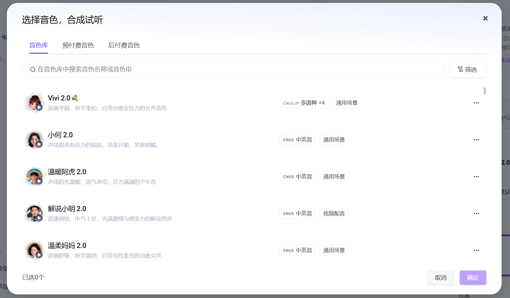
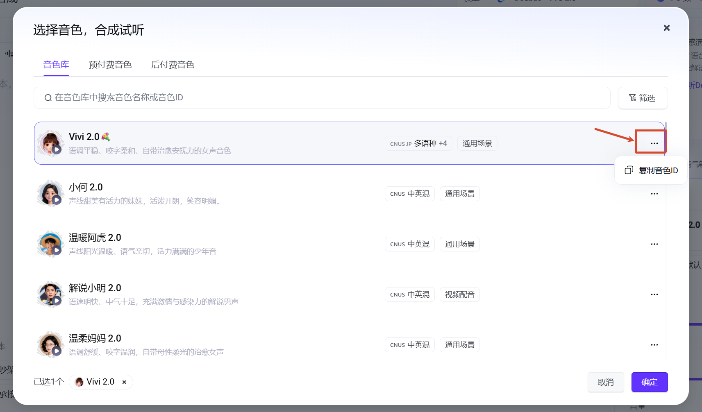
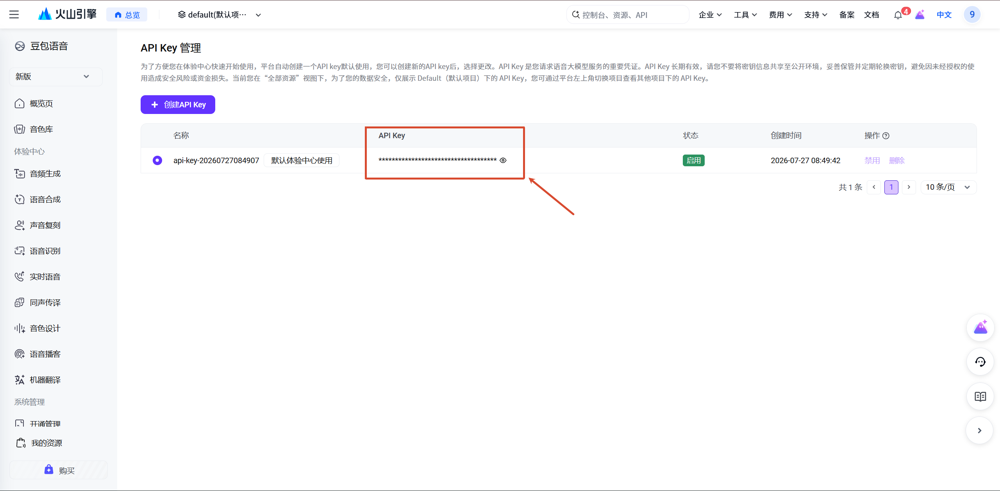
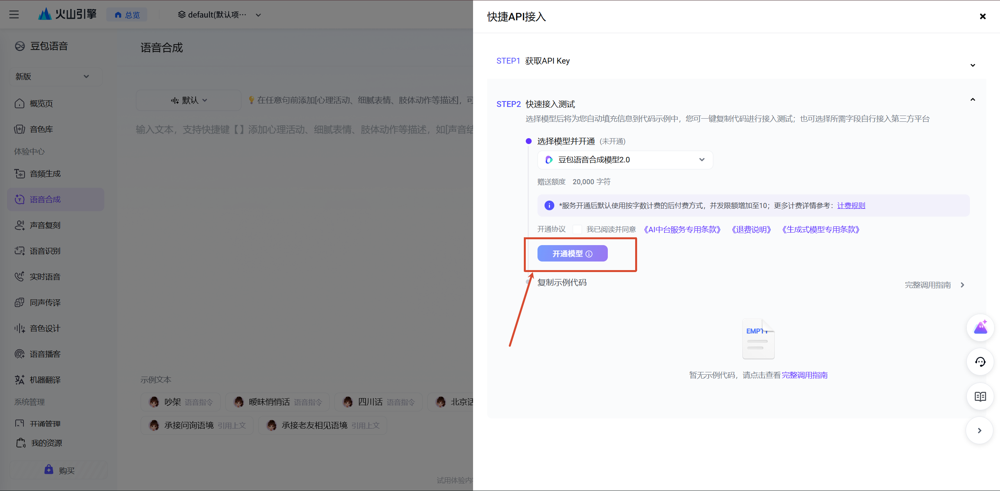
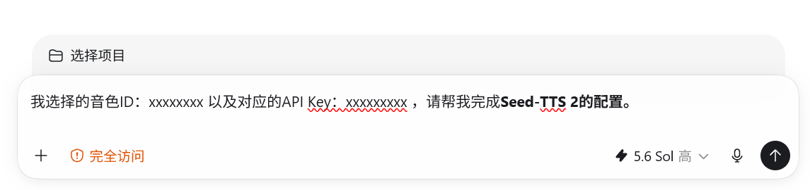

# Seed-TTS 2 图文配置教程

VOX Video Starter 使用火山引擎 Seed-TTS 2 生成完整旁白。旁白生成后，项目会用 Whisper 对齐字幕，再用字幕时间驱动画面、人物、标签、转场和音效。因此，音色 ID 和 API Key 是正式配音与后续成片所需的唯一外部服务配置。

完成本教程后，你会得到两项内容：

- 你选择的 Seed-TTS 2 音色 ID；
- 一个已经开通语音合成服务的 API Key。

控制台界面和活动额度可能调整，按钮位置请以火山引擎实时页面为准。

## 1. 进入语音合成体验页

打开 [火山引擎语音合成](https://console.volcengine.com/speech/new/experience/tts?projectName=default)，登录账号并进入豆包语音的“语音合成”页面。


确认顶部模型选择的是 `Doubao - TTS 2.0` 或当前控制台对应的 Seed-TTS 2 模型。

## 2. 试听并选择音色

页面右侧会显示当前音色。点击音色切换入口，打开音色库。


音色库提供不同性别、语言、口音和使用场景的声音。逐个试听，选择适合自己内容调性的音色。



## 3. 复制音色 ID

选中音色后，点击该音色右侧的更多菜单，再点击“复制音色ID”。音色名称不能替代音色 ID，交给 Codex 时应提供复制出来的完整 ID。



音色 ID 不是密钥，可以正常保存在本期配置中。

## 4. 创建或取得 API Key

打开 [API Key 管理](https://console.volcengine.com/speech/new/setting/apikeys?projectName=default)。可以使用平台自动创建的 Key，也可以创建一个专门用于本项目的新 Key。



API Key 属于敏感凭据：不要把它提交到 GitHub、粘贴到公开 Issue、放进截图或发送给不可信的第三方。

## 5. 开通 Seed-TTS 2 模型

回到语音合成页面，点击右上角“API调用”。


在快捷 API 接入面板中选择豆包语音合成模型 2.0，阅读服务协议和计费规则，然后点击“开通模型”。仅创建 API Key、但没有开通模型时，接口仍然无法正常合成语音。



截图制作时，控制台显示首次开通可能赠送 `20,000` 字符额度。该额度属于平台活动信息，可能随时间、地区或账号变化，请以你开通时页面展示的内容为准。

## 6. 交给 Codex 完成项目配置

回到运行 VOX Video Starter 的本地 Codex 任务，发送：

```text
我已经开通 Seed-TTS 2。
我选择的音色 ID：<你的音色ID>
API Key：<你的API Key>
请按照仓库安全规则完成配置和验证，不要回显或记录我的 API Key。
```



Agent 会把 API Key 写入被 Git 忽略的 `studio/.env`，把音色 ID 写入项目配置，并运行环境检查。不要把真实 Key 写进 README、`episode.json`、脚本、命令行参数或 Git 提交。

## 7. 确认配置成功

Agent 应在 `studio/` 中运行：

```text
pnpm run doctor
```

检查结果应该显示 Seed-TTS 2 API Key 已配置，但不能打印 Key 的值。第一次正式制作视频时，Agent 会用完整逐字稿发起一次 TTS 请求，并验证返回的音频文件。

常见失败原因：

- API Key 已复制，但模型服务尚未开通；
- 浏览器登录了另一个火山引擎项目，Key 不属于当前项目；
- 复制的是音色名称，而不是音色 ID；
- Key 前后带有多余空格；
- 账号余额、额度或服务状态不足。

## 计费说明

原教程制作时的参考价格为：

- 1,000 字约 `0.30 元`；
- 10 万字按量约 `30 元`；
- 当时页面显示的 10 万字资源包约 `28 元`。

以上不是固定报价。购买或调用前，请查看 [火山引擎豆包语音计费说明](https://docs.volcengine.com/docs/6561/1359370?lang=zh) 和控制台实时价格。
